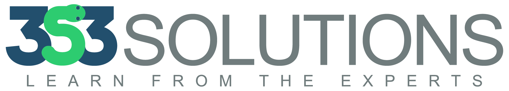
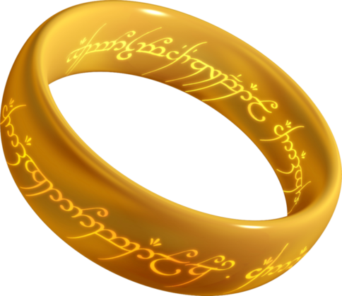
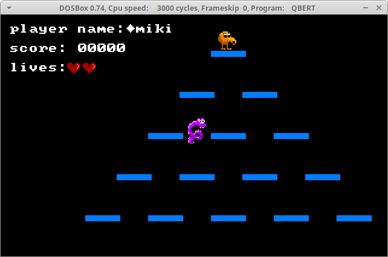

% 4 Languages You Must Learn

# Miki Tebeka


---

## Why Other Language?



---

## If all you have is a hammer


<small>
(photo by [Marco Verch](https://www.flickr.com/photos/149561324@N03/24216243048/))
</small>

---

## 4 **Types** of Languages You Must Learn

---

## 1. Procedural/OO

Python, Go, C, C++, Java, Perl, PHP, Ruby, C#,  ...

---

**fact.py**
```python
def fact(n):
    total = 1
    for i in range(1, n+1):
        total *= i
    return total
```

**fact.go**
```go
func fact(n int) int {
	total := 1
	for n > 0 {
		total *= n
		n--
	}
	return total
}
```

---

## I'd Try C/Go

### Books
* [Object Oriented C](https://www.cs.rit.edu/~ats/books/ooc.pdf)
* [The Go Programming Language](https://www.amazon.com/Programming-Language-Addison-Wesley-Professional-Computing/dp/0134190440)

---

## 2. Assembly

Know the machine!

---

**fact.s**
```asm
_start:
    movl $5, %eax   # Send value to compute in eax
    jmp fact
end:
    movl %eax, %ebx # Set result as return value
    movl $1, %eax   # System exit
    int $0x80

fact:
    movl %eax, %ecx  # Loop n -1 times
    decl %ecx
fact_loop:
    imul %ecx, %eax  # n = n * n-1
    loop fact_loop
    jmp end
```

---

```
$ make fact
as -o %.o fact.s
ld -o fact %.o
$ ls -lh fact
-rwxrwxr-x 1 miki miki 864 Mar  2 18:23 fact
./fact
120 ↵
```

---



---

## Books

* [Programming from the Ground Up](http://nongnu.askapache.com/pgubook/ProgrammingGroundUp-1-0-booksize.pdf) (PDF)
* [Assembly Programming Tutorial](https://www.tutorialspoint.com/assembly_programming/index.htm) (using [nasm](http://www.nasm.us/))
* [Assemblers and Loaders](https://www.davidsalomon.name/assem.advertis/asl.pdf)


---

## 3. Functional

* Lispish
    * Lisp - [SBCL](http://www.sbcl.org/)
    * Scheme - [Racket](https://racket-lang.org/)
    * [Clojure](https://clojure.org/)
* Haskell - [GHC](https://www.haskell.org/ghc/)
* ML - [OCaml](https://ocaml.org/)

---

**fact.scm**
```scheme
(define (fact n)
  (let loop ((n n) (acc 1))
    (if (zero? n)
      acc
      (loop (- n 1) (* n acc)))))
```

**fact.py**
```python
def fact(n):
    def _fact(n, acc):
        if n == 1:
            return acc
        return _fact(n-1, acc*n)
    return _fact(n, 1)
```

---

**fact.py**
```python
def fact(n):
    if n == 1:
        return n
    return n * fact(n - 1)
```

---

**fact.hs**
```haskell
fact n = foldl (*) 1 [1..n]
```

**fact.py**
```python
from operator import mul
from functools import reduce

def fact(n):
    return reduce(mul, range(1, n+1))
```

---

## I'd Try Clojure/Haskell

### Books

* [SICP](https://mitpress.mit.edu/sicp/full-text/book/book-Z-H-4.html#%_toc_start)
* [Learn You a Haskell for Great Good](http://learnyouahaskell.com/chapters)
* [Real World Haskell](http://book.realworldhaskell.org/read/) 
* [Practical Common Lisp](http://www.gigamonkeys.com/book/)
* [Paradigms of Artificial Intelligence Programming](https://github.com/norvig/paip-lisp)
* [On Lisp](http://www.paulgraham.com/onlisp.html)

---


---

## Also Everything by Norvig

Or maybe [make your own Lisp](https://github.com/kanaka/mal)

---

## 4. Logic

**fact.pl**
```prolog
fact(1, 1).
fact(N, F) :-
    N > 0,
    N1 is N - 1,
    fact(N1, F1),
    F is N * F1.
```

```
?- fact(10, X).
X = 3628800 .
```

---

**fact.py**
```python
def fact(n):
    if n == 1:
        return n
    n1 = n - 1
    return n * fact(n1)
```

---

## Give Me Some Change

**coins.pl**
```prolog
coin(dollar, 100).
coin(half, 50).
coin(quarter, 25).
coin(dime,10).
coin(nickel,5).
coin(penny,1).

change(0, []).
change(A, [(C, Num)|L]) :-
    coin(C, V),
    A >= V,
    Num is floor(A / V),
    B is A mod V,
    change(B, L).
```

---

```
?- change(60, X).
X = [(half, 1),  (dime, 1)] ;
X = [(half, 1),  (nickel, 2)] ;
X = [(half, 1),  (penny, 10)] ;
X = [(quarter, 2),  (dime, 1)] ;
X = [(quarter, 2),  (nickel, 2)] ;
X = [(quarter, 2),  (penny, 10)] ;
X = [(dime, 6)] ;
X = [(nickel, 12)] ;
X = [(penny, 60)] ;
false.
```

---

## Try [SWI Prolog](http://www.swi-prolog.org/)

[Prolog Experiments in Discrete Mathematics](http://samples.jbpub.com/9780763772062/PrologLabBook09.pdf) - PDF Book

---

## How To Learn

Write code, read code.

Practice

* [Project Euler](https://projecteuler.net/archives)
* [Advent of Code](http://adventofcode.com/)

Then scratch and itch with the language you learn


---

## To Summarize

Learn 4 types of languages, it'll expand your mind.

* Procedural/OO (C/Go)
* Assembly (x86)
* Functional (Clojure/Haskell)
* Logical (SWI Prolog)


---
# Thank You


