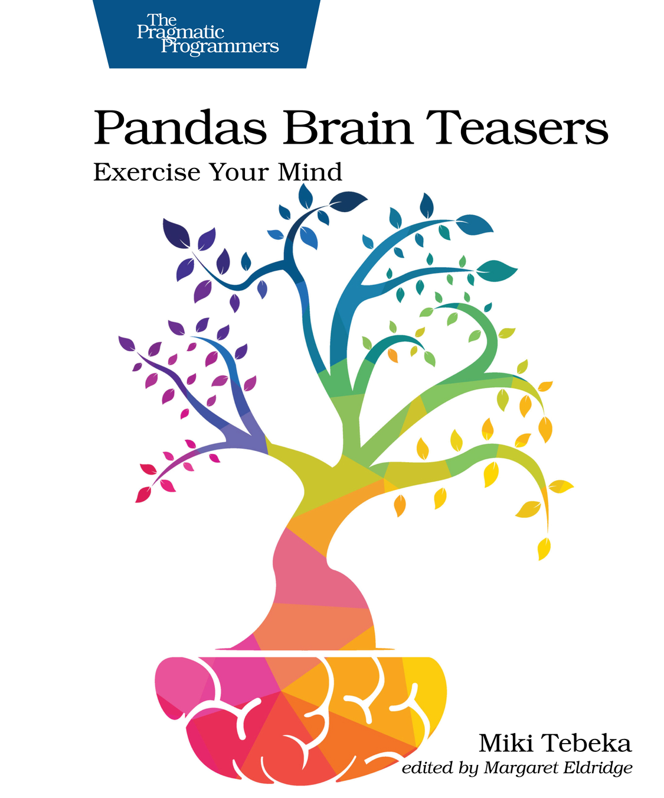

# Pandas Quiz

A backup talk for [PyData Tel Aviv 2023](pydata.org/telaviv2023/).

Selected questions from 

[](https://pragprog.com/titles/d-pandas/pandas-brain-teasers/)


## Running

You'll need the following installed:
- Python requirements from [requirements.txt](requirements.txt)
- The `source-highlight` command line tool

Optional: Exit `quiz.yml` to set timeout and what quizzes to run.

Start IPython and run

```
%run setup.ipy
```

Then run `%next` for each puzzle.
